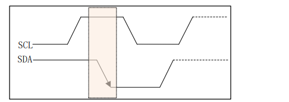
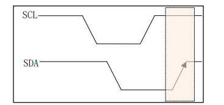
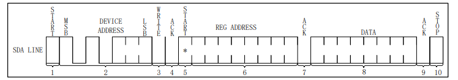

# I2C

I2C（Inter-Integrated Circuit）通信总线，作为嵌入式系统设计中的一个关键组成部分，其灵活性和高效率使其在高级应用中备受青睐。本文旨在提供关于I2C通信总线的深度解析，包括其基本概念、特点、通信协议，以及在不同场景下的高级应用和最佳实践。I2C接口只有2根信号线，总线上可以连接多个设备，硬件实现简单，可扩展性强。I2C通信协议可以用普通GPIO引脚进行软件模拟。I2C接口主要用于通讯速率要求不高，以及多个器件之间通信的应用场景。

串行、同步、半双工

## 数据帧
1.开始和停止条件：  
start：SDA先下拉、SCL再下拉
    
end：SCL先上拉、SDA再上拉    
  
2.数据传输：  
SCL为高电平，SDA为高电平时为读，为低电平时为写  

3.应答信号：
主机发送8位数据以后，等待接收从机发送的一个ACK信号，ACK信号为低电平，NACK信号为高电平
4.一帧数据
8位数据 + ACK信号 
5.I2C 写时序 （低位先发送），
1）start  
2）发送设备地址（一般是7位）和写位，最低一位为读写位（0，写；1，读）   
3）从机发送的 ACK 应答信号  
4）重新发送开始信号  
5）发送要写入数据的寄存器地址  
6)、从机发送的 ACK 应答信号  
7)、发送要写入寄存器的数据    
8)、从机发送的 ACK 应答信号  
9)、停止信号  
    

6.I2C 读时序
需要使用I2C写时序定位到要读的寄存器。即使用6.I2C 写时序 1）~5）步骤，然后再重新发送开始信号，发送设备地址读（7位地址左移，然后加一），然后发送要读的寄存器地址。

7.多字节读写
I2C可以顺序读，即读完一个字节后，再读下一个字节。
但顺序读，要每次重新发送要写的寄存器地址


## Linux

### 常用调试方法
```bash
i2cdetect -y -r  6              #查看 i2c-6 上是否有设备接入
i2cdetect -l                    #查看所有 i2c 总线
i2cdump -f -y 6 0x51            #查看 i2c-6 上地址为 0x51 的设备中所有寄存器的值
i2cget -f -y 6 0x51 0x02        #读取 i2c-6 上地址为 0x51 的设备上 0x02 寄存器的值
i2cset -f -y 6 0x51 0x02 0x12   #写入 i2c-6 上地址为 0x51 的设备上 0x02 寄存器 
```


